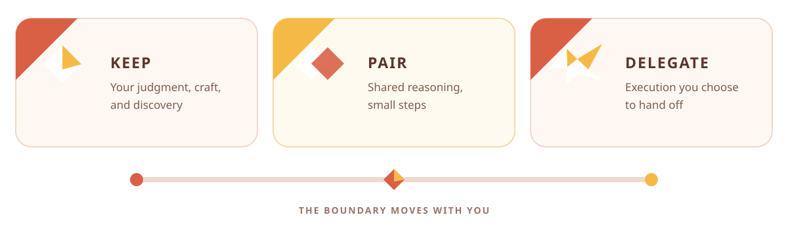
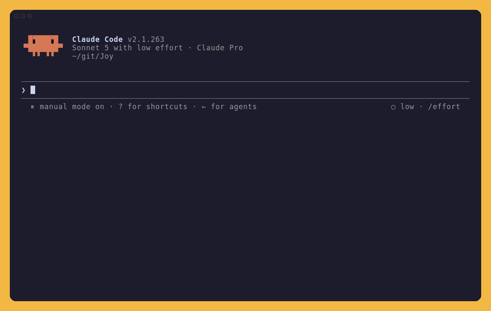
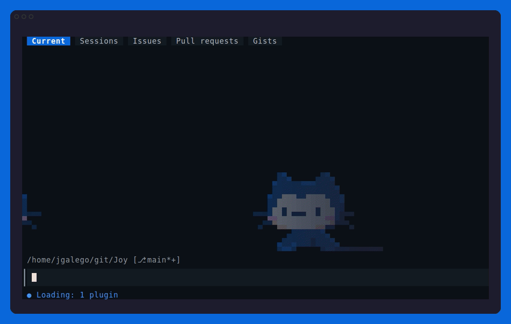

<div align="center">
	
	<h1>Joy</h1>
	<p><strong>Keep the joy. Let go of the toil.</strong></p>
	<p>
		<a href="https://code.claude.com/docs/en/overview"></a>
		<a href="https://docs.github.com/en/copilot/concepts/agents/copilot-cli/about-copilot-cli"></a>
		<a href="https://agentskills.io"></a>
	</p>
	<p>
		<a href="https://github.com/JGalego/Joy/actions/workflows/ci.yml"></a>
		<a href="LICENSE"></a>
	</p>
	<p><a href="https://jgalego.github.io/Joy/"><strong>Explore Joy →</strong></a></p>
	<p><strong>Install:</strong> <code>npx skills add JGalego/Joy --skill joy --agent claude-code --global --yes</code></p>
</div>

> “When you’re choosing what to keep, ask your heart; when you’re choosing where to store something, ask your house!”
>
> — Marie Kondo

Joy is a KonMari-inspired Agent Skill for Claude Code and GitHub Copilot CLI that helps you decide what to delegate without giving away the parts of programming you love.

AI agents are good at removing friction, but they can also remove discovery, understanding, problem-solving, craftsmanship, and authorship before the user chooses to give those up. Joy adds a focused intervention:

> **Which part do you want to remain yours?**

<p align="center">
	
</p>

It distinguishes meaningful challenge from incidental toil. It is not anti-AI, anti-productivity, or a claim that all difficulty is worthwhile.

## 🎬 See Joy in action

<details open>
<summary><strong>Claude Code</strong> — <code>pair</code> mode</summary>

<br>

<p align="center">
	<a href="https://jgalego.github.io/Joy/?demo=claude#demo"></a>
	<br>
	<a href="https://jgalego.github.io/Joy/?demo=claude#demo"><strong>Open the interactive recording →</strong></a>
</p>

</details>

<details open>
<summary><strong>GitHub Copilot CLI</strong> — <code>learn</code> mode</summary>

<br>

<p align="center">
	<a href="https://jgalego.github.io/Joy/?demo=copilot#demo"></a>
	<br>
	<a href="https://jgalego.github.io/Joy/?demo=copilot#demo"><strong>Open the interactive recording →</strong></a>
</p>

</details>

**Note:** These recordings run the local plugin in interactive CLI sessions. The GIF fallbacks come from [assets/claude.tape](assets/claude.tape) and [assets/copilot.tape](assets/copilot.tape) with [VHS](https://github.com/charmbracelet/vhs). The Joy site uses [assets/claude.cast](assets/claude.cast) and [assets/copilot.cast](assets/copilot.cast) with [asciinema-player](https://github.com/asciinema/asciinema-player), adding pause, seek, speed, fullscreen, and selectable text. Wording may vary when recordings are regenerated.

## 📦 Install

### From skills.sh

The canonical skill is in [skills/joy](skills/joy), the layout discovered by the skills CLI. Install it globally for Claude Code:

```sh
npx skills add JGalego/Joy --skill joy --agent claude-code --global --yes
```

### As a personal Claude Code skill

From a clone of this repository:

```sh
mkdir -p ~/.claude/skills
cp -R skills/joy ~/.claude/skills/joy
```

Restart Claude Code if the personal skills directory did not already exist. Invoke Joy as `/joy pair`.

### As a Claude Code plugin

The repository is also a valid single-plugin marketplace:

```text
/plugin marketplace add JGalego/Joy
/plugin install joy@joy
```

Marketplace plugins have a guaranteed namespaced invocation:

```text
/joy:joy pair
```

Current Claude Code versions also accept the bare `/joy pair` alias unless another command already uses `joy`.

For local development, load the checkout directly:

```sh
claude --plugin-dir .
```

## 🎛️ Use

Joy can activate from requests about preserving authorship, learning without receiving the answer, pair programming, avoiding comprehension debt, deciding what to delegate, or tidying a repository.

### Modes

Explicit personal-skill invocations use `/joy <mode>`:

<details>
<summary><strong>Not sure which mode fits?</strong></summary>

- 📚 **I want to understand it** → `/joy learn`
- 🤝 **I want to work through it together** → `/joy pair`
- 🛠️ **I want to author the important code** → `/joy craft`
- 🚀 **I want it completed safely** → `/joy ship`
- 🧹 **I want to decide what stays** → `/joy tidy`
- ⏸️ **I want Joy to step back** → `/joy off`

</details>

| Mode | Protects or optimizes |
| --- | --- |
| 🤝 `pair` | Small collaborative steps; the default |
| 📚 `learn` | Understanding, hypotheses, and graduated hints |
| 🛠️ `craft` | Architecture and hands-on implementation authored by the user |
| 🚀 `ship` | Safe autonomous completion with a concise explanation |
| 🧹 `tidy` | Evidence-based **Keep**, **Refine**, and **Let go** review |
| ⏸️ `off` | Normal assistant behavior without Joy-specific rules |

Examples:

```text
/joy learn
Help me find this binary-search bug, but do not solve it for me.

/joy craft
Prepare tests for my cache, but leave the implementation empty.

/joy ship
Fix the failing authentication tests and validate the change.

/joy tidy
Review this repository and propose cleanup before deleting anything.

/joy off
```

A selected mode remains active in the current conversation until changed. “Just do it” switches the current task to `ship`. Explicit instructions always override inferred preferences.

## 🧭 The ownership boundary

- **Keep** — the user owns the work.
- **Pair** — the user and AI work through it together.
- **Delegate** — the AI may execute it autonomously.

The boundary can change at any time. Joy asks at most one ownership question at the start of a substantial ambiguous task, never for trivial work, and not when the user already made the boundary clear.

Tidying uses a different decision: **Keep**, **Refine**, or **Let go**. Destructive tidying is proposed before it is applied unless autonomous cleanup was explicitly requested.

## ⚠️ Limitations

- Joy is prompt-guided behavior, not a deterministic policy engine. Review important output and generated code.
- It cannot know what a user enjoys; it can only preserve boundaries the user states or confirms.
- Mode and boundary state live in the current conversation, not across new sessions.
- The evaluations describe observable outcomes for human or model review. Structural validation does not prove semantic compliance.
- Plugin invocations are namespaced when the bare `joy` alias conflicts.

## 🧪 Development and evaluation

The skill has no runtime dependencies or build step.

The optional [justfile](justfile) wraps the common development tasks:

```sh
just           # list recipes
just validate  # dependency-free structural checks
just check     # complete local publication suite
just demo      # re-record the Claude Code GIF
just demo-copilot # re-record the Copilot CLI GIF
just cast      # re-record both interactive terminal casts
just site      # preview the Joy site locally
just run       # launch the local plugin
```

Run the dependency-free structural validator:

```sh
node scripts/validate.mjs
```

Re-recording the GIFs requires VHS and an authenticated installation of the corresponding CLI:

```sh
vhs assets/claude.tape
vhs assets/copilot.tape
```

Each tape opens an interactive session and writes [assets/claude.gif](assets/claude.gif) or [assets/copilot.gif](assets/copilot.gif). Re-recording uses model quota and may produce different wording.

The interactive casts require [asciinema](https://docs.asciinema.org/manual/cli/installation/). Run `just cast-claude` or `just cast-copilot` for a specific CLI, or `just cast` for both. Run `just site`, then open <http://localhost:4173/> to test the same landing page deployed by [the Pages workflow](.github/workflows/pages.yml).

When Claude Code is installed, also run its official validators:

```sh
claude plugin validate . --strict
claude plugin validate ./skills --strict
```

Load the plugin locally with `claude --plugin-dir .`, then exercise the prompts in [skills/joy/evals/evals.json](skills/joy/evals/evals.json). Each fixture states intended outcomes and assertions rather than requiring exact wording. For meaningful comparison, run each case in a fresh session with Joy and without Joy, then record concrete evidence for every assertion. No paid API, credential, or fabricated benchmark is required by this repository.

CI runs the same structural validator. It checks frontmatter, names, manifests, mode and command consistency, evaluation coverage, internal links, and common publication mistakes.

Before publishing changes to the skill or plugin metadata, bump the semantic version in [.claude-plugin/plugin.json](.claude-plugin/plugin.json); Claude Code uses that explicit version to decide whether an installed plugin should update.

## ⚖️ Independence and trademarks

Joy is an independent open-source project. It is not affiliated with or endorsed by Marie Kondo or KonMari Media, Inc. “KonMari” is used only to describe the project's inspiration; no official logos, visual identity, or persona are used.

Joy is also independent of Anthropic. “Claude” and “Claude Code” are trademarks of Anthropic PBC. See the [MIT License](LICENSE) for this project's terms.
